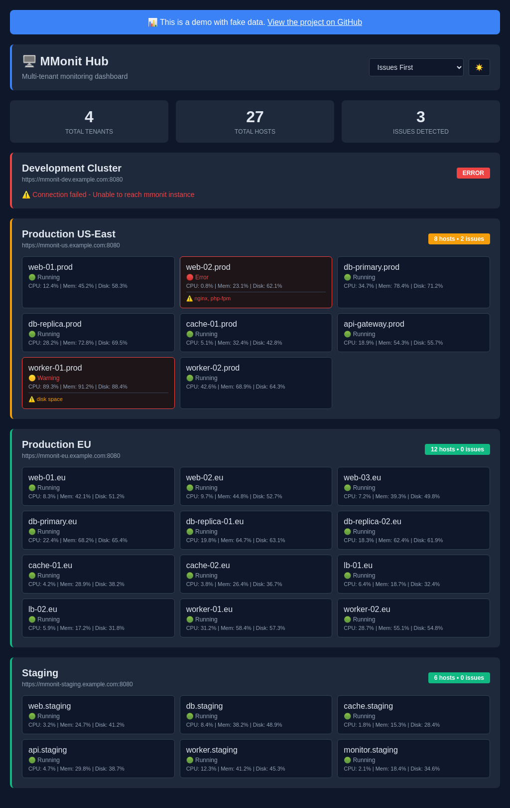
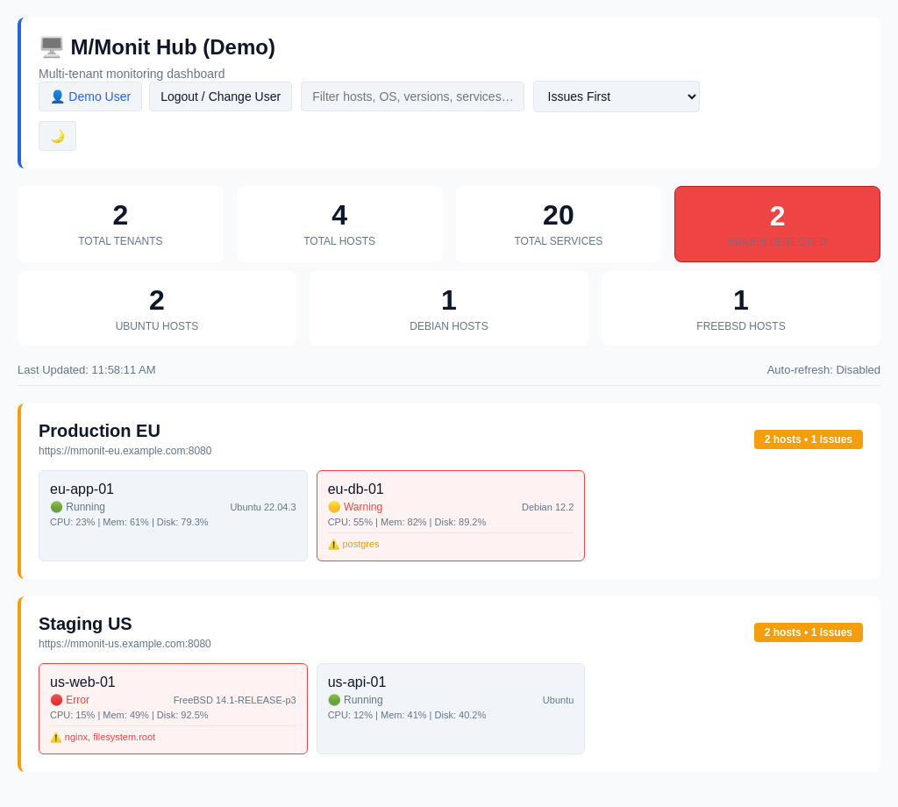

# M/Monit Hub (Flask Edition)

A lightweight, multi-tenant monitoring dashboard that aggregates multiple [M/Monit](https://mmonit.com/) instances into a single unified interface — now built with **Flask** for improved modularity, extensibility, and authentication.

---

## 🚀 What's New (Flask Release)

- 🔁 Rebuilt using **Flask** with cleaner structure (`app.py`, `mmonit_hub/` package).
- 🧠 **Session-based login** instead of HTTP Basic Auth.
- 🧩 Easier deployment via **Gunicorn** or `flask run`.
- 🧰 Simplified setup using a **Makefile** (`make venv`, `make run`, `make clean`).
- 🎨 Improved UI: clearer alerts, disk usage warnings, and color consistency.
- 🧭 Added **browser icon (favicon)** and `manifest.json` for better PWA support.
- 🧮 Extended host detail view with full service list and disk usage alerts.
- ⚡ Auto-refresh updates without page reload.

---

## 🎯 Live Demo

**[View Live Demo →](https://floadsio.github.io/mmonit-hub/demo.html)**

Try the interactive demo with fake data to see how M/Monit Hub works.

### Dark Theme


### Light Theme


---

## Features

- 🔒 **Session Authentication** – Secure web login with password hashing (no Basic Auth).
- 🧑‍💻 **User Isolation** – Configure which **tenants** each dashboard user can access.
- 🌐 **Multi-Tenant Support** – Aggregate multiple M/Monit instances in one UI.
- ⏱️ **Auto Refresh** – Live updates every N seconds (configurable).
- 💾 **Disk Alerts** – Shows warnings for high disk usage (80% / 90% thresholds).
- ⚠️ **Visual Alerts** – Red/Yellow status cards for quick problem detection.
- 🖥️ **Detailed Host View** – Click any host to see full service list and filesystem info.
- 🎨 **Light/Dark Themes** – Automatic or manual theme switching.
- 📱 **Responsive Layout** – Works beautifully on desktop, tablet, and mobile.
- 🧭 **PWA-ready** – Includes favicon and manifest for browser/app integration.

---

## 🧩 Project Structure

mmonit-hub/
├── app.py                  # Flask app entrypoint
├── auth_utils.py           # User login/session management
├── config_loader.py        # Config file loader and validator
├── data_fetcher.py         # Fetches and aggregates M/Monit API data
├── frontend_html.py        # Renders dashboard views
├── mmonit_hub/             # Flask package (namespace)
│   └── init.py
├── static/                 # CSS, JS, icons
│   ├── style.css
│   ├── script.js
│   └── icons/
│       ├── favicon.ico
│       ├── favicon-512.png
│       └── manifest.json
├── templates/              # Flask Jinja2 templates
│   ├── index.html
│   └── login.html
├── Makefile
├── mmonit-hub.conf.example # Example config file
├── requirements.txt
├── LICENSE
└── README.md

---

## ⚙️ Requirements

- Python 3.8+
- One or more [M/Monit](https://mmonit.com/) instances with HTTP API enabled
- Recommended: `gunicorn` for production

---

## 🧰 Installation & Setup

### 1. Clone the repository
```bash
git clone https://github.com/floadsio/mmonit-hub.git
cd mmonit-hub

2. Create a virtual environment

make venv

3. Activate and install dependencies

source .venv/bin/activate
make install

4. Copy and edit configuration

cp mmonit-hub.conf.example mmonit-hub.conf

Edit the file to define your dashboard users and M/Monit instances.

Example:

{
  "port": 8082,
  "auto_refresh_seconds": 30,
  "users": [
    {
      "username": "admin",
      "password": "hashed-password",
      "tenants": ["*"]
    }
  ],
  "instances": [
    {
      "name": "Production EU",
      "url": "https://mmonit.example.com:8080",
      "username": "admin",
      "password": "secret",
      "verify_ssl": false
    }
  ]
}

5. Generate password hashes

python3 app.py --hash-password

Paste the generated hash into your config file.

6. Run the app

make run

or, in production:

gunicorn -w 2 -b 0.0.0.0:8082 app:app


⸻

🧹 Makefile Commands

Command	Description
make venv	Create Python virtual environment
make install	Install dependencies inside .venv
make run	Run Flask app (flask run)
make gunicorn	Run with Gunicorn (prod-ready)
make clean	Remove .venv, cache, and temporary files


⸻

🔍 Dashboard Overview
	•	Tenants: Each represents one M/Monit instance.
	•	Host cards: Show hostname, CPU, memory, and disk usage.
	•	Color codes:
	•	🟢 OK – all services running
	•	🟡 Warning – partial issues or high disk usage
	•	🔴 Error – service down or unreachable
	•	Host modal: Full detail view with services, disk usage, and link to M/Monit.

⸻

⚙️ Configuration Notes
	•	auto_refresh_seconds: how often data refreshes automatically (0 = disable).
	•	Disk usage alert thresholds are 80% (warning) and 90% (error).
	•	verify_ssl can be disabled for self-signed M/Monit certs.

⸻

🔒 Security Best Practices
	•	Use HTTPS for all M/Monit URLs.
	•	Store mmonit-hub.conf outside public directories.
	•	Don’t commit it to Git (it’s .gitignored by default).
	•	Run behind Nginx/Apache with auth & rate limiting if exposed publicly.

⸻

🧠 Troubleshooting

Issue	Fix
No hosts appear	Check API credentials and tenant names
401 Unauthorized	Verify login and hashed password
SSL errors	Set "verify_ssl": false or use valid certs
Port already in use	Edit port in config or use lsof -i :8082
Disk usage not visible	Ensure M/Monit reports filesystem stats


⸻

🧩 Development

To reset everything and start fresh:

make clean
make venv
make install
make run


⸻

📜 License

MIT License – see LICENSE

⸻

🏗️ Credits

Created by floads.io

Built for monitoring multiple M/Monit instances.

⸻

🧩 Support
	•	Issues: GitHub Issues
	•	Documentation: M/Monit API Docs

⸻

Note: This is an independent tool and is not affiliated with or endorsed by Tildeslash Ltd or M/Monit.